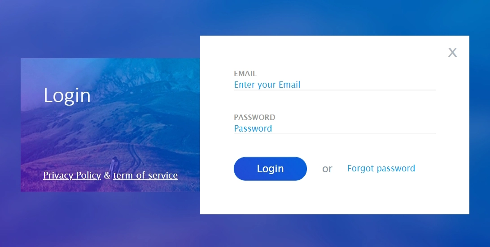

# Mountains Sign Up

 
 

Loging form with working button links to 
 __Sign up ⮞ Login ⮞ Forgot__ Password.
 Website was created to learn basic form creation.

Site published at: https://mantodinas.github.io/mountains-sign-up/

Created by Mantas Petrauskas 
 more projects https://github.com/mantodinas

